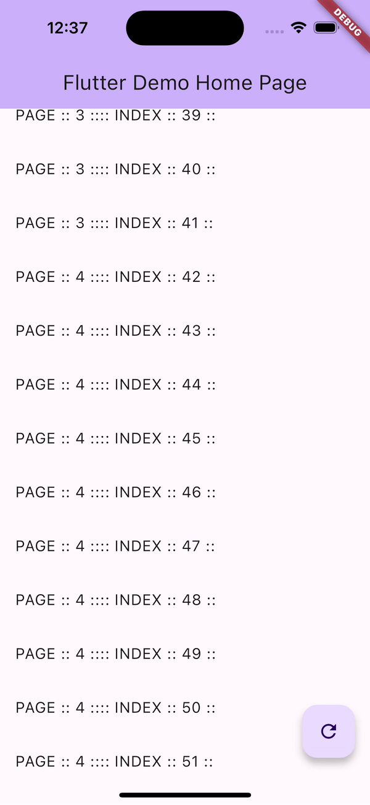
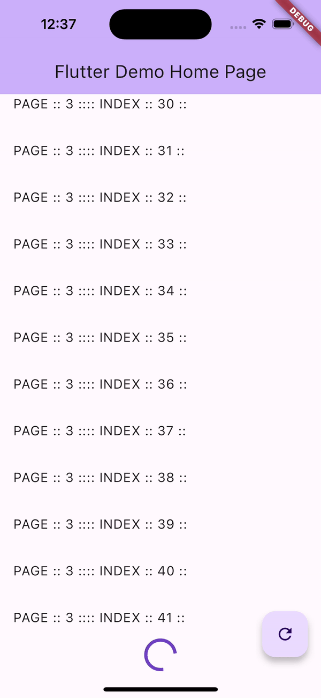

# Advanced Infinite Scroll

2023 © Bikramaditya Meher

[](https://pub.dartlang.org/packages/advanced_infinite_scroll) [](https://github.com/bikram0000/advanced_infinite_scroll/blob/master/LICENSE)

A versatile Flutter package for implementing advanced scrolling. Whether you're looking for infinite scrolling, responsive grid views, or customizable loaders, `AdvancedInfiniteScroll` has got you covered.

 


## Features:

- Infinite Scrolling
- Responsive Grid/List Views
- Pull-to-Refresh Capability
- Customizable Loaders For Loading More or Initial Loader
- "No Data Found" Widget Handling
- "ON ERROR" Widget Handling,
- Optimized Rendering for Visible Items
- Header/Footer widget
- empty loader size (check example)

## Usage:

To use this package, add `advanced_infinite_scroll` as a dependency in your `pubspec.yaml` file.

### Data Fetching:

You can fetch data from your network or any source. For demonstration purposes, here's a dummy data-fetching function:

```dart
Future<List<String>> onListFutureDummy(int page, int perPage, Map? params) async {
  debugPrint("ON LOAD DATA AIS :: $page");
  await Future.delayed(const Duration(seconds: 1));
  return List.generate(perPage, (index) => "PAGE :: $page ::");
  // return [];
}
```

This function simulates a network call with a delay and generates dummy data.


### Basic Setup:

Here's a simple example demonstrating the usage:

```dart
     AdvancedInfiniteScroll<String>(
        minItemWidth: 120,
        minItemsPerRow: 1,
        maxItemsPerRow: 1,
        keepAlive:true,
        controller: controller,
        loaderSize: 1,
        headerWidget: Container(
          height: 50,
          color: Colors.green,
          child: const Center(child: Text("Header")),
        ),
        footerWidget: Container(
          height: 50,
          color: Colors.red,
          child: const Center(child: Text("Header")),
        ),
        noDataFoundWidget: (c) {
          return TextButton(
            onPressed: () {
              c.refresh();
            },
            child: const Text("Refresh"),
          );
        },
        loadingWidget: const Center(child: CircularProgressIndicator()),
        // onFuture: onListFutureDummy,
        loadingMoreWidget: Center(
          child: Padding(
            padding: const EdgeInsets.all(10),
            child: LinearProgressIndicator(
              minHeight: 60,
              valueColor: AlwaysStoppedAnimation<Color>(Colors.grey.shade50),
            ),
          ),
        ),
        builder: (BuildContext context, listData, index) {
          return ListTile(
            title: Text(
              "${listData[index]}:: INDEX :: $index ::",
            ),
          );
        },
      ),
```

### Parameters:

Here's a brief overview of the key parameters:

- `minItemWidth`: The minimum width for an item.
- `keepAlive`: If you wanted to keep Alive this widget.
- `minItemsPerRow`: The minimum number of items per row.
- `controller`: The controller associated with `AdvancedInfiniteScroll`.
- `loadingMoreWidget`: A widget to display while more items are being loaded.
- `builder`: A function that returns a list of widgets based on the provided data.


For more information and please checkout example folder.


## Contributing:

Feel free to submit issues or pull requests to enhance the package. Contributions are always welcome!